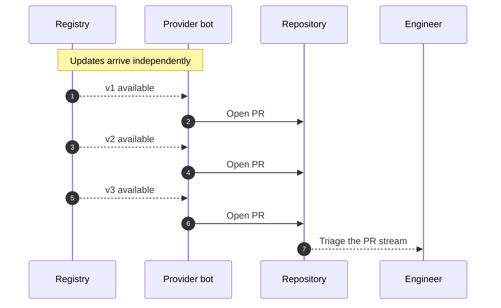
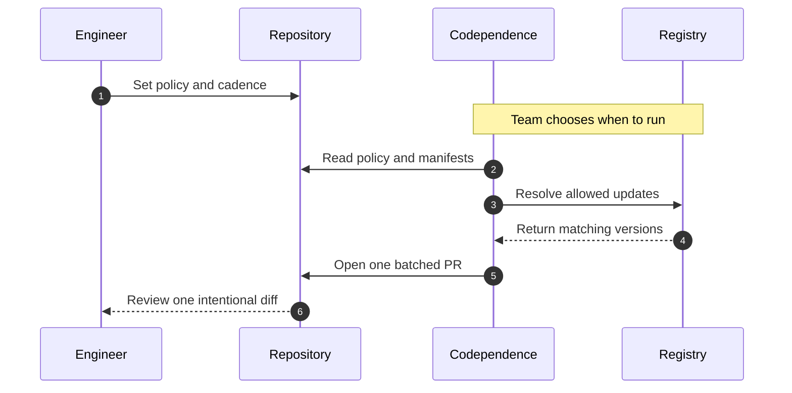

# [Codependence](https://jeffry.in/codependence/)

[](https://www.npmjs.com/package/codependence)
[](https://www.npmjs.com/package/codependence)
[](https://scorecard.dev/viewer/?uri=github.com/yowainwright/codependence)
[](https://codecov.io/gh/yowainwright/codependence)

#### One configuration for every dependency manager.

**Codependence** checks and updates dependency versions using [one-to-many](https://en.wikipedia.org/wiki/One-to-many_%28data_model%29) project policies with support for Node, Python, Go, Rust, Docker, and GitHub Actions. 

This means you control how you update and why you update. Versus other tools, Codependence caters to a project's context vs a dependency's context.

---

## Main use case

### Pin what matters and update the rest

Suppose a project must stay on React `^19.0.0`, but its other dependencies should keep moving. Add that policy to `.codependencerc`:

```json
{
  "config": {
    "app": {
      "path": "package.json",
      "manager": "pnpm",
      "mode": "precise",
      "codependencies": [{ "react": "^19.0.0" }]
    }
  }
}
```

Update:

```sh
npm run update
```

React stays pinned while lodash updates:

```diff
 "dependencies": {
   "react": "^19.0.0",
-  "lodash": "^4.17.20"
+  "lodash": "^4.17.21"
 }
```

The policy runs the same thing everywhere!—Locally in scripts or in CI; it's the same and you own it. 
See more [recipes below](#recipes)!

---

## Install

<!-- installation commands matching package.json name and the Homebrew release workflow -->

via npm in the project
```sh
npm install codependence
```
For direct CLI use:
```sh
npm install --global codependence
```
or via brew
```sh
brew install yowainwright/tap/codependence
```
It is a top priority to make this official to brew as quickly as possible for your security benefit!

---

## Configuration

<!-- init command behavior from src/cli/index.ts -->

```json
{
  "scripts": {
    "init": "codependence init",
    "update": "codependence --update"
  }
}
```

```sh
npm run init
```

That's it!

### What `init` does

1. Finds package manifests.
2. Prompts you to seemlessly setup dependency policy and enforcement.
3. Creates or updates the configuration.

> [!NOTE]
> Use `init config [directory]` for configuration only and `init actions` to generate GitHub Actions workflows.
>
> For a JavaScript project, you can use a `codependence` dependency policy object in `package.json`. 
> For larger or mixed-language projects, you can create Codependence config files for your project's dependency needs:

```json
{
  "codependence": "./.codependencerc"
}
```

The config path is relative to manifest files, e.g. `package.json`.
Each entry in `config` represents one manifest and requires `path` and `manager`; `name` is optional.

> [!NOTE]
> Editors can use the published [configuration schema][configuration-schema] for validation and completion.

[configuration-schema]: https://unpkg.com/codependence/src/config/schema.json

## Seemless Maintenance

Once you're dependency policy is as you desire, all that's left is maintenance. AKA

```sh
npm run update
```

That's it but readme below for how you can be more nuanced about maintenance below!

---

## CLI

Codependence, although it can be used with Node.js, or only ci, is a CLI-first policy tool.

The direct commands below assume the global npm or Homebrew install shown above.

> Run `codependence --help` for every option.

<!-- CLI command and options from src/cli/constants.ts -->

### Init

Codependence consists of just 1 commands, `init`.

```sh
Usage: codependence [command] [options]

Commands:
  init [directory]                  Run guided project setup
  init config [directory]           Create or update configuration only
  init actions [managers...]        Generate GitHub Actions workflows
```

Init has sub commands and there are options but that's it. 
This also hopefully feels pretty simple and understantable. 

### Option Reference

Configuration can live in `package.json` or a referenced `.codependencerc`. 
Use CLI flags for execution choices such as checking, updating, and output formatting.

### From policy to result

The config defines the manifest and dependency policy. The CLI decides whether to
check, preview, or write the result.

`.codependencerc`:

```jsonc
{
  "config": {
    "web": {
      "path": "package.json",
      "manager": "pnpm",
      "codependencies": [{ "lodash": "4.17.21" }]
    }
  }
}
```

Check the policy and save a machine-readable report. The manifest is unchanged:

```sh
codependence --format json --outputFile dependency-report.json
```

The report describes the result and exit status:

```json
{
  "status": "outdated",
  "exitCode": 1,
  "dependencies": [
    {
      "package": "lodash",
      "current": "4.17.20",
      "latest": "4.17.21",
      "isPinned": true,
      "severity": "patch",
      "canAutoUpdate": true
    }
  ],
  "summary": {
    "totalPackages": 1,
    "outdated": 1,
    "upToDate": 0
  }
}
```

The actual report also includes a runtime-dependent `duration` value.

Apply the same policy with `--update`:

```sh
codependence --update
```

The approved manifest entry changes as follows:

```diff
-  "lodash": "4.17.20"
+  "lodash": "4.17.21"
```

Use `--dryRun` with `--update` to show that change without writing it:

```sh
codependence --update --dryRun
```

```jsonc
{
  "update": true,
  "dryRun": true
}
```

The same policy can run in GitHub Actions. The workflow reads `.codependencerc`
and turns the update result into a pull request:

```yaml
name: Update dependencies

on:
  schedule:
    - cron: "0 9 * * 1"
  workflow_dispatch:

jobs:
  dependencies:
    runs-on: ubuntu-latest
    steps:
      - uses: actions/checkout@v4
      - uses: yowainwright/codependence@v1
        with:
          targets: pnpm
          version: 11.21.0
          pull-request: true
          token: ${{ secrets.CODEPENDENCE_TOKEN }}
          post-update-command: pnpm install
```

---

#### `config`: manifest dictionary

<!-- manifest config shape from src/types.ts and src/config/index.ts -->

Each key identifies one manifest. Every entry requires a direct `path` and a
`manager`; `name` is optional. Policy fields apply only to that manifest.

```jsonc
{
  "config": {
    "web": {
      "name": "@project/web",
      "path": "packages/web/package.json",
      "manager": "pnpm",
      "codependencies": ["typescript"]
    },
    "actions": {
      "path": ".github/workflows/update.yml",
      "manager": "github-actions",
      "mode": "precise"
    }
  }
}
```

---

#### `codependencies`: `Array<string | Record<string, string>>`

`codependencies` is a manifest policy array. String entries track the latest version; object entries pin an exact version or range.

- The default value is `undefined`
- An array is required!

```jsonc
{
  "codependencies": ["lodash", { "react": "19.0.0" }]
}
```

---

> [!NOTE]
> #### Version policy entries
> The Codependence `codependencies` array supports `latest` out-of-the-box.
> So having this:
> - `["fs-extra", "lodash"]` will return the latest semver versions of the packages within the array. 
> - Codepence will also match a specified version, like  `[{ "foo": "1.0.0" }]` and `[{ "foo": "^1.0.0" }]` or `[{ "foo": "~1.0.0" }]`. 
> - You can also include a `*` **at the end** of a name you would like to match. 
>   ##### For example: 
>   - `@foo/*` will match all packages with `@foo/` in the name and return their latest versions. 
>   - This will also work with `foo-*`, etc.

**Codependence** is built in to give you more capability to control your dependencies!

---

#### Manifest fields

Define the manifest file, dependency manager, and optional `name`.

```jsonc
{
  "config": {
    "web": {
      "path": "packages/web/package.json",
      "manager": "pnpm",
      "name": "@project/web"
    }
  }
}
```

---

#### `update`: `boolean`

When `true`, apply updates across all configured entries. The default is
`false`.

```jsonc
{
  "update": true
}
```

---

#### `rootDir`: `string`

Set the manifest search directory. The default is `"./"`.

```jsonc
{
  "rootDir": "packages/web"
}
```

---

#### `ignore`: `Array<string>`

Provide glob patterns to skip. An explicit array replaces the default ignores.

```jsonc
{
  // Replaces the default ignore patterns.
  "ignore": ["examples/**", "fixtures/**"]
}
```

---

#### `debug`: `boolean`

Enable diagnostic logging. The default is `false`.

```jsonc
{
  "debug": true
}
```

---

#### `silent`: `boolean`

Suppress normal output while preserving errors. The default is `false`.

```jsonc
{
  "silent": true
}
```

---

#### `--config`: `string`

Use a specific configuration file instead of auto-discovery.

```sh
codependence --config ./config/.codependencerc
```

---

#### `searchPath`: `string`

Set where configuration discovery starts.

```sh
codependence --searchPath ./services/api
```

---

#### `yarnConfig`: `boolean`

Enable Yarn configuration support. The default is `false`.

```sh
codependence --yarnConfig
```

---

#### `permissive`: `boolean`

When `true`, update everything except the dependencies listed in
`codependencies`.

```jsonc
{
  // Pin these dependencies; update the rest.
  "permissive": true,
  "codependencies": ["react", "typescript"]
}
```

---

#### `level`: `"patch" | "minor" | "major"`

An **optional** string constraining how far updates are allowed to reach.

- `"patch"` — only update within the same minor version (e.g. `1.2.x`)
- `"minor"` — only update within the same major version (e.g. `1.x.x`)
- `"major"` — allow any update (default)

`codependence --level minor --update` applies the limit for one run.

```jsonc
{
  "level": "minor",
  "update": true
}
```

---

#### `mode`: `"verbose" | "precise"`

An **optional** string controlling which packages are checked.

- `"verbose"` — only check/update the packages listed in `codependencies` (0.x compatible behavior)
- `"precise"` — update all dependencies except those listed in `codependencies` (same as permissive behavior)

```jsonc
{
  "mode": "precise",
  "codependencies": ["react"],
  "update": true
}
```

This keeps `react` pinned while allowing unlisted dependencies to update. The
one-off equivalent is `codependence --mode precise --codependencies react --update`.

---

#### `dryRun`: `boolean`

An **optional** boolean that previews what would change without modifying any files.

- The default value is `false`

```jsonc
{
  "update": true,
  "dryRun": true
}
```

This reports the update candidates and leaves manifests and lockfiles unchanged.

---

#### `interactive`: `boolean`

An **optional** boolean that prompts you to select which packages to update when combined with `--update`.

- The default value is `false`

```jsonc
{
  "update": true,
  "interactive": true
}
```

The one-off equivalent is `codependence --update --interactive`.

---

#### `watch`: `boolean`

An **optional** boolean that enables continuous checking, re-running every 30 seconds.

- The default value is `false`

```jsonc
{
  "watch": true
}
```

The CLI re-checks the configured manifests every 30 seconds.

---

#### `noCache`: `boolean`

An **optional** boolean that bypasses the version cache for fresh registry results.

- The default value is `false`

```jsonc
{
  "noCache": true
}
```

The one-off equivalent is `codependence --noCache`.

---

#### `format`: `"json" | "markdown" | "table"`

An **optional** string specifying the output format. When set, disables the spinner and outputs structured data instead.

- `"json"` — machine-readable JSON
- `"markdown"` — Markdown table (useful for PR comments)
- `"table"` — formatted table (default when flag is used)

```jsonc
{
  "format": "markdown",
  "outputFile": "dependency-report.md"
}
```

The one-off equivalent is `codependence --format markdown --outputFile dependency-report.md`.

---

#### `outputFile`: `string`

An **optional** path to write formatted output to a file instead of stdout. Requires `format` to be set.

```jsonc
{
  "format": "json",
  "outputFile": "dependency-report.json"
}
```

---

## CI

<!-- generated workflow behavior from src/cli/index.ts -->

### Github Actions

Codependece currently has a Github action.
In order to use it, you do need to setup your configration first.

Generate split workflows from the configured managers:

```sh
npm run init -- actions
```

- This creates up to six stable workflow files for Node, Python, Go, Rust,
Docker, and GitHub Actions. 
- Docker runs alone so its updates stay on the
`update-dependencies/docker` pull-request branch. 
- Existing files are preserved
unless `--force` is provided.

<!-- partial update and pull request inputs from action.yml -->

To run one configured manager with an exact tool version, do this:

```yaml
- uses: yowainwright/codependence@v1
  with:
    targets: bun
    version: 1.3.14
```

### Actions with Rust

Rust accepts exact stable `x.y.z` toolchains and normalizes an optional leading
`v` before invoking rustup.

### Actions with Docker

Public Docker Hub and GHCR images need no registry inputs. Private images use
repository secrets without placing credentials in `.codependencerc`:

```yaml
- uses: yowainwright/codependence@v1
  with:
    targets: docker
    dockerhub-username: ${{ vars.DOCKERHUB_USERNAME }}
    dockerhub-token: ${{ secrets.DOCKERHUB_TOKEN }}
    ghcr-username: ${{ github.actor }}
    ghcr-token: ${{ secrets.GITHUB_TOKEN }}
```

### Pull Request (PR) Mode

PR mode requires a fine-grained PAT and `post-update-command`. 

- Each manager set uses a stable branch, so scheduled Bun, Go, Rust, uv, Docker, and GitHub Actions workflows maintain separate pull requests while repeated runs update the
existing PR. 

See the [GitHub Action guide](.github/ACTION.md) for lockfile
policy and PAT permissions.

---

## JavaScrpt Server Side API

Although **Codependence** is built primarily as a CLI utility, it can be used as a JavaScript Server Side utility.

```ts
import { checkFiles, codependence } from "codependence";

const checkForOutdated = async () => {
  try {
    await checkFiles({ codependencies: ["fs-extra", "lodash"] });
    console.log("All dependencies are up-to-date");
  } catch (err) {
    console.error("Dependencies are out of date:", (err as Error).message);
  }
};

const updateAllExceptSpecific = async () => {
  await codependence({
    codependencies: ["react", "lodash"],
    permissive: true,
    update: true,
  });
};

checkForOutdated();
```

---

## Recipes

Read below to see different ways Codependence might help you!

### Check deps _without_ a config

Use CLI policy flags for a temporary check:

```sh
codependence --codependencies 'lodash' '{ "fs-extra": "10.0.1" }'
```

### Match packages by name

Use `*` at the end of a package name to match a group:

```sh
codependence --codependencies '@foo/*' --update
```

### Pin selected packages and update the rest

List the packages that should stay pinned

```sh
codependence --permissive --codependencies 'react' 'lodash' --update
```

### Configure multiple manifests

You can configure multiple project manifests via a single or multiple codependence policy files.

1. Use a skey for each manifest. 
2. `name` can distinguish manifests in the same directory.

```jsonc
{
  "config": {
    "web": {
      "name": "@project/web",
      "path": "packages/web/package.json",
      "manager": "pnpm",
      "mode": "precise"
    },
    "api": {
      "path": "services/api/go.mod",
      "manager": "go",
      "mode": "precise"
    }
  }
}
```

---

## Multi-language, multi-package manager support (experimental)

Declare each ecosystem through a manifest entry in `.codependencerc`. The
`--language` flag remains available for one-off runs:

```sh
codependence --language python
```

Use one supported language per run: `nodejs`, `python`, `go`, `rust`,
`docker`, or `github-actions`.

### Supported managers

#### Languages

> ##### Language manifest updates
> 
> - Non-Node providers remain experimental, but all managers can share one `config` dictionary.
> - Python requirements updates preserve comments, markers, hashes, and include directives. 
> - Unversioned and URL-based requirements are left unchanged. After updating manifests, regenerate and commit ecosystem lockfiles with their native package managers.

| Language | Package managers | Status | Manifest files |
| --- | --- | --- | --- |
| JavaScript | <ul><li>[bun](https://bun.sh/)</li><li>[npm](https://www.npmjs.com/)</li><li>[pnpm](https://pnpm.io/)</li><li>[yarn](https://yarnpkg.com/)</li></ul> | Supported | `package.json` |
| Python | <ul><li>[conda](https://conda.org/)</li><li>[pip](https://pip.pypa.io/)</li><li>[pipenv](https://pipenv.pypa.io/)</li><li>[poetry](https://python-poetry.org/)</li><li>[uv](https://docs.astral.sh/uv/)</li></ul> | Experimental | `requirements.txt`, `pyproject.toml`, `Pipfile`, `environment.yml` |
| Go | [golang](https://go.dev/) | Experimental | `go.mod` |
| Rust | [cargo](https://doc.rust-lang.org/cargo/) | Experimental | `Cargo.toml` |

#### Operations

| Containers | CI |
| --- | --- |
| [docker](https://www.docker.com/)<br>Experimental<br>`Dockerfile` | [github-actions](https://github.com/features/actions)<br>Experimental<br>`.github/workflows/*.yml`, `.github/workflows/*.yaml` |

> [!NOTE]
> Docker support is experimental.

The Docker provider supports explicit pins, latest tag resolution, and
`mode: "precise"` for Docker Hub and GHCR images.

Tag resolution:

- Selects the highest stable numeric tag that is at least as specific as the current tag and preserves its exact prefix and suffix. For example, `20-slim` remains in the `-slim` family, and `3.19` does not switch to a date tag.
- Resolves repeated images with different tag families independently.
- Resolves `FROM` tags assembled from one Docker `ARG` without changing the composition.
- Leaves digest-pinned images, scratch stages, unresolved variables, and unsupported registries unchanged.
- Fails on mutable tags such as `latest` instead of guessing a version.

For authenticated registry access, set `DOCKERHUB_USERNAME` and
`DOCKERHUB_TOKEN` for Docker Hub, or `GHCR_USERNAME` and `GHCR_TOKEN` for GHCR.
Both GHCR values are required. Docker Hub PATs should be read-only; private
GHCR packages require `read:packages` access.

> [!NOTE]
> GitHub Actions support is experimental.

The GitHub Actions provider supports explicit pins, latest release resolution,
and `mode: "precise"`.

- Latest versions resolve to immutable commit SHAs, and existing version comments are refreshed with the release tag.
- Local and Docker actions remain unchanged.
- Authenticated lookups use `GITHUB_TOKEN` or `GH_TOKEN` when available.
- For private GHCR packages, the action falls back to its workflow token and retries anonymously when GHCR rejects that token for a public package.


> [!NOTE]
> Execution options such as `update`, `dryRun`, `format`, and `noCache` stay at the root. 
>
> Use `--target pnpm` or `--target go` to run only entries for those managers.

<!-- provider capabilities from src/providers/*/index.ts -->

--- 

## Policy Surface

Codependence currently focuses on package manifests and dependency sections. 
The same policy model can expand to other version surfaces over time.

| Surface                        | Status       | Purpose                                                                    |
| ------------------------------ | ------------ | -------------------------------------------------------------------------- |
| `package.json` dependencies    | Supported    | Enforce dependency policy in Node.js projects and monorepos                |
| Python, Go, and Rust manifests | Experimental | Apply the same check/update workflow outside Node.js                       |
| Dockerfiles                    | Experimental | Check base image versions                                                  |
| GitHub Actions workflows       | Experimental | Check action refs in workflow YAML                                         |
| Local repository scans         | Roadmap      | Report drift across a directory of projects, such as `~/code`              |
| Toolchain files                | Roadmap      | Keep `.nvmrc`, `.node-version`, `.tool-versions`, and `.mise.toml` aligned |
| Compose and other CI YAML      | Roadmap      | Check service images, actions, and runtime versions in pipeline files      |

---

> [!NOTE]
> ### Codependencies are project dependencies that must stay current or match a specified version.
> 
> When a manifest cannot use `latest` directly, Codependence writes the resolved version required by its policy. Exact versions and supported ranges remain explicit in `.codependencerc`.

---

## Why use Codependence?

**Codependence** is focused on one job: enforcing dependency version policy where your code actually runs.

#### Traditional dependency PRs vs. Codependence

Traditional providers create an update stream for engineers to triage.
Codependence lets the team choose the cadence and review one batched diff.

---

Traditional providers open PRs as versions appear, leaving engineers to triage
the stream. Codependence runs on the team's cadence and opens one policy-driven
PR for review.

<details>
<summary>View Mermaid source</summary>

##### Traditional dependency PR flow



##### Codependence cadence-controlled flow



</details>

- It gives teams a small, explicit policy for versions that must stay current or pinned.
- It can fail CI when dependency versions drift.
- It can update only listed packages, or update everything except listed packages.
- It manages multiple dependency managers and monorepo scopes from one `.codependencerc`.
- It runs locally, from npm scripts, in GitHub Actions, or in other CI providers.
- It exposes a Node API for custom workflows and internal tooling.

---

### Why _not_ use Codependence?

**Codependence** isn't for everybody or every repository. Here are some reasons why it _might not_ be for you!

- You only need hosted dependency PRs and are happy with Dependabot or Renovate.
- You do not need local or CI enforcement for version drift.
- You prefer manually pinning versions without automated checks.
- You do not need package-specific or workspace-specific dependency policy.

---

## Demos

In Action!

- **[Codependence Cron](https://github.com/yowainwright/codependence-cron):** Codependence running off a GitHub Action cron job.
- **[Codependence Monorepo](https://github.com/yowainwright/codependence-monorepo):** Codependence monorepo example.

---

## Debugging

### `private packages`

If there is a `.npmrc` file, there is no issue with **Codependence** monitoring private packages. However, if a yarn config is used, Codependence must be instructed to run `version` checks differently.

### Fixes

- With the CLI, add the `--yarnConfig` option.
- With Node.js, add `yarnConfig: true` to your options or your config.
- For other private package issues, submit an [issue](https://github.com/yowainwright/codependence/issues) or [pull request](https://github.com/yowainwright/codependence/pulls).

---

## Development

The repository uses Node.js 26 and pnpm 11. [mise](https://mise.jdx.dev/) installs the pinned development tools.

```sh
mise install
pnpm install
pnpm test
```

### Release Strategy

Codependence publishes securely to npm with trusted publishing, provenance attestations, and immutable GitHub release assets.
Stable releases also publish an audited, SHA256-pinned Homebrew formula through a protected environment and reviewed tap pull request.

### 0.3.1 compatibility

The v1 CLI keeps the final pre-1.0 contract from `0.3.1`: the `codependence`
and `cdp` binaries, pre-1.0 CLI flags, flat and embedded `package.json` policy,
and listed-only `codependencies` behavior. The named `script` export retains
the pre-1.0 non-throwing API. Use `checkFiles` or `codependence` when callers
need v1 errors and version-diff results.

---

### Contributing

[Contributing](.github/CONTRIBUTING.md) is straightforward.

### Issues

- Include context and reproduction steps.
- Submit a pull request when appropriate.

### Pull Requests

- Add a test or explain why one is not needed.
- Update the README when behavior or documentation changes.
- Use the [pull request template](.github/PULL_REQUEST_TEMPLATE.md).

Thank you!

---

## Shoutouts

Thanks to [Dev Wells](https://github.com/devdumpling) and [Steve Cox](https://github.com/stevejcox) for the aligned code leading to this project. Thanks [Navid](https://github.com/NavidK0) for some great insights to improve the API!

---

Made by [@yowainwright](https://github.com/yowainwright), MIT 2022-present
