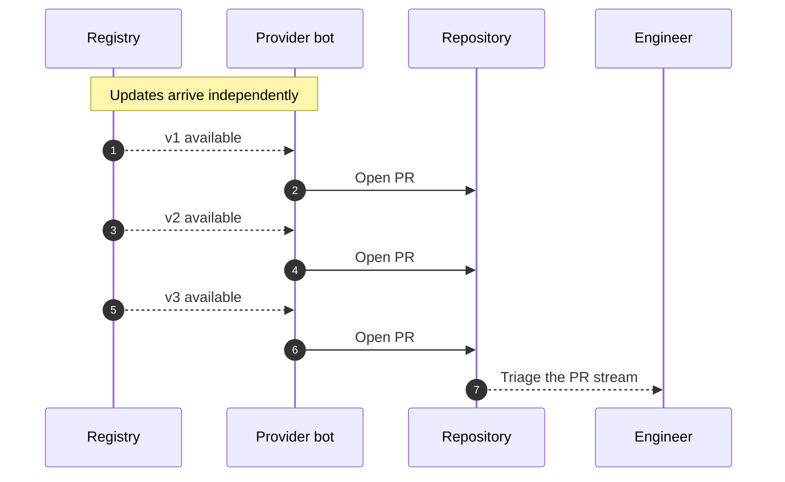
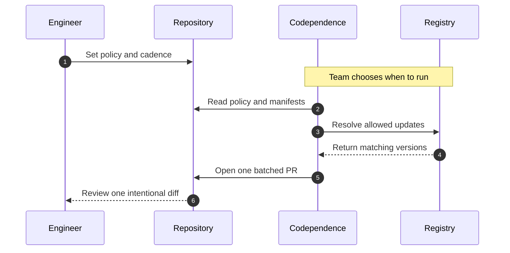

# [Codependence](https://jeffry.in/codependence/)

[](https://www.npmjs.com/package/codependence)
[](https://www.npmjs.com/package/codependence)
[](https://scorecard.dev/viewer/?uri=github.com/yowainwright/codependence)
[](https://codecov.io/gh/yowainwright/codependence)

#### One configuration for every dependency manager.

**Codependence** checks and updates dependency versions using [one-to-many](https://en.wikipedia.org/wiki/One-to-many_%28data_model%29) project policies with support for Node, Python, Go, Rust, Docker, and GitHub Actions. 

This means you control how you update and why you update. Versus other tools, Codependence caters to a project's context vs a dependency's context.

---

## Main use case

### Pin what matters and update the rest

Suppose a project must stay on React `^19.0.0`, but its other dependencies should keep moving. Add that policy to `.codependencerc`:

```diff
{
  "config": {
    "app": {
      "path": "package.json",
      "manager": "pnpm",
+      "mode": "precise",
+      "codependencies": [{ "react": "^19.0.0" }]
    }
  }
}
```

After adding `"update": "codependence --update"` to `package.json` as shown in
[Configuration](#configuration), run:

```sh
npm run update
```

React stays pinned while lodash updates:

```diff
 "dependencies": {
   "react": "^19.0.0",
-  "lodash": "^4.17.20"
+  "lodash": "^4.17.21"
 }
```

The policy runs the same thing everywhere!—Locally in scripts or in CI; it's the same and you own it. 
See more [recipes below](#recipes)!

---

## Install

<!-- installation commands matching package.json name and the Homebrew release workflow -->

via npm in the project
```sh
npm install codependence
```
For direct CLI use:
```sh
npm install --global codependence
```
or via brew
```sh
brew install yowainwright/tap/codependence
```
It is a top priority to make this official to brew as quickly as possible for your security benefit!

---

## Configuration

<!-- init command behavior from src/cli/index.ts -->

```diff
{
+  "scripts": {
+    "init": "codependence init",
+    "update": "codependence --update"
+  }
}
```

```sh
npm run init
```

That's it!

### What `init` does

1. Finds package manifests.
2. Prompts you to seemlessly setup dependency policy and enforcement.
3. Creates or updates the configuration.

> [!NOTE]
> Use `init config [directory]` for configuration only and `init actions` to generate GitHub Actions workflows.
>
> For a JavaScript project, you can use a `codependence` dependency policy object in `package.json`. 
> For larger or mixed-language projects, you can create Codependence config files for your project's dependency needs:

```diff
{
+  "codependence": "./.codependencerc"
}
```

The config path is relative to manifest files, e.g. `package.json`.
Each entry in `config` represents one manifest and requires `path` and `manager`; `name` is optional.

> [!NOTE]
> Editors can use the published [configuration schema][configuration-schema] for validation and completion.

[configuration-schema]: https://unpkg.com/codependence/src/config/schema.json

## Seemless Maintenance

Once you're dependency policy is as you desire, all that's left is maintenance. AKA

```sh
npm run update
```

That's it but readme below for how you can be more nuanced about maintenance below!

---

## CLI

Codependence, although it can be used with Node.js, or only ci, is a CLI-first policy tool.

The direct commands below assume the global npm or Homebrew install shown above.

> Run `codependence --help` for every option.

<!-- CLI command and options from src/cli/constants.ts -->

### Init

Codependence consists of just 1 commands, `init`.

```sh
Usage: codependence [command] [options]

Commands:
  init [directory]                  Run guided project setup
  init config [directory]           Create or update configuration only
  init actions [managers...]        Generate GitHub Actions workflows
```

Init has sub commands and there are options but that's it. 
This also hopefully feels pretty simple and understantable. 

### Option Reference

Configuration can live in `package.json` or a referenced `.codependencerc`. 
Use CLI flags for execution choices such as checking, updating, and output formatting.

### From policy to result

The config defines the manifest and dependency policy. The CLI decides whether to
check, preview, or write the result.

`.codependencerc`:

```diff
{
  "config": {
    "web": {
      "path": "package.json",
      "manager": "pnpm",
+      "codependencies": [{ "lodash": "4.17.21" }]
    }
  }
}
```

Check the policy and save a machine-readable report. The manifest is unchanged:

```sh
codependence --format json --outputFile dependency-report.json
```

The report describes the result and exit status:

```json
{
  "status": "outdated",
  "exitCode": 1,
  "dependencies": [
    {
      "package": "lodash",
      "current": "4.17.20",
      "latest": "4.17.21",
      "isPinned": true,
      "severity": "patch",
      "canAutoUpdate": true
    }
  ],
  "summary": {
    "totalPackages": 1,
    "outdated": 1,
    "upToDate": 0
  }
}
```

The actual report also includes a runtime-dependent `duration` value.

Apply the same policy with `--update`:

```sh
codependence --update
```

The approved manifest entry changes as follows:

```diff
-  "lodash": "4.17.20"
+  "lodash": "4.17.21"
```

Use `--dryRun` with `--update` to show that change without writing it:

```sh
codependence --update --dryRun
```

```diff
{
+  "update": true,
+  "dryRun": true
}
```

The same policy can run in GitHub Actions. The workflow reads `.codependencerc`
and turns the update result into a pull request:

```yaml
name: Update dependencies

on:
  schedule:
    - cron: "0 9 * * 1"
  workflow_dispatch:

jobs:
  dependencies:
    runs-on: ubuntu-latest
    steps:
      - uses: actions/checkout@v4
      - uses: yowainwright/codependence@v1
        with:
          targets: pnpm
          version: 11.21.0
          pull-request: true
          token: ${{ secrets.CODEPENDENCE_TOKEN }}
          post-update-command: pnpm install
```

---

#### `config`

> Type: **`Record<string, CodependenceManifest>`**

<!-- manifest config shape from src/types.ts and src/config/index.ts -->

Each key identifies one manifest. Every entry requires a direct `path` and a
`manager`; `name` is optional. Policy fields apply only to that manifest.

```diff
{
+  "config": {
+    "web": {
+      "name": "@project/web",
+      "path": "packages/web/package.json",
+      "manager": "pnpm",
+      "codependencies": ["typescript"]
+    },
+    "actions": {
+      "path": ".github/workflows/update.yml",
+      "manager": "github-actions",
+      "mode": "precise"
+    }
+  }
}
```

---

#### `codependencies`

> Type: **`Array<string | Record<string, string>>`**
> Default: `undefined`

Defines the packages controlled by policy. String entries name a package; object entries name a package with an exact version or range. In `verbose` mode, listed packages are checked or updated. In `precise` mode, listed packages are held back while the rest can update.

```diff
{
+  "codependencies": ["lodash", { "react": "^19.0.0" }]
}
```

Check or update only listed packages:

```diff
{
+  "mode": "verbose",
+  "codependencies": ["lodash"],
+  "update": true
}
```

```sh
codependence --mode verbose --codependencies lodash --update
```

```diff
 "dependencies": {
-  "lodash": "^4.17.20",
+  "lodash": "^4.17.21",
   "react": "^19.0.0"
 }
```

Pin listed packages and update the rest:

```diff
{
+  "mode": "precise",
+  "codependencies": [{ "react": "^19.0.0" }],
+  "update": true
}
```

```sh
codependence --mode precise --codependencies react --update
```

```diff
 "dependencies": {
   "react": "^19.0.0",
-  "lodash": "^4.17.20"
+  "lodash": "^4.17.21"
 }
```

> [!NOTE]
> `--codependencies` accepts package names. Use config when a package needs an exact version or range.

---

#### Manifest fields

Define the manifest file, dependency manager, and optional `name`.

```diff
{
+  "config": {
+    "web": {
+      "path": "packages/web/package.json",
+      "manager": "pnpm",
+      "name": "@project/web"
+    }
+  }
}
```

---

#### `update`

> Type: **`boolean`**
> Default: `false`

Applies approved dependency changes to manifest files. When `false`, Codependence only checks and reports.

```diff
{
+  "update": true
}
```

Run the same behavior from the CLI:

```sh
codependence --update
```

With `mode: "precise"`, listed packages stay pinned and unlisted packages can update.

```diff
{
+  "mode": "precise",
+  "codependencies": [{ "react": "^19.0.0" }],
+  "update": true
}
```

```diff
 "dependencies": {
   "react": "^19.0.0",
-  "lodash": "^4.17.20"
+  "lodash": "^4.17.21"
 }
```

> [!NOTE]
> Use `dryRun: true` or `--dryRun` to preview the same update without writing files.

---

#### `rootDir`

> Type: **`string`**
> Default: `"./"`

Set the manifest search directory. The default is `"./"`.

```diff
{
+  "rootDir": "packages/web"
}
```

---

#### `ignore`

> Type: **`Array<string>`**

Provide glob patterns to skip. An explicit array replaces the default ignores.

```diff
{
+  // Replaces the default ignore patterns.
+  "ignore": ["examples/**", "fixtures/**"]
}
```

---

#### `debug`

> Type: **`boolean`**
> Default: `false`

Enable diagnostic logging. The default is `false`.

```diff
{
+  "debug": true
}
```

---

#### `silent`

> Type: **`boolean`**
> Default: `false`

Suppress normal output while preserving errors. The default is `false`.

```diff
{
+  "silent": true
}
```

---

#### `--config`

> Type: **`string`**
> Default: `undefined`

Use a specific configuration file instead of auto-discovery.

```sh
codependence --config ./config/.codependencerc
```

---

#### `searchPath`

> Type: **`string`**
> Default: `undefined`

Set where configuration discovery starts.

```sh
codependence --searchPath ./services/api
```

---

#### `yarnConfig`

> Type: **`boolean`**
> Default: `false`

Enable Yarn configuration support. The default is `false`.

```sh
codependence --yarnConfig
```

---

#### `permissive`

> Type: **`boolean`**
> Default: `undefined`

Treats listed `codependencies` as pins. When `true`, Codependence holds those packages back and updates everything else. This is equivalent to `mode: "precise"`.

```diff
{
+  "permissive": true,
+  "codependencies": ["react"],
+  "update": true
}
```

Run the same behavior from the CLI:

```sh
codependence --permissive --codependencies react --update
```

The listed package stays unchanged while unlisted packages can update:

```diff
 "dependencies": {
   "react": "^19.0.0",
-  "lodash": "^4.17.20"
+  "lodash": "^4.17.21"
 }
```

> [!NOTE]
> Prefer `mode: "precise"` in new config. `permissive` remains supported for compatibility.

---

#### `level`

> Type: **`"patch" | "minor" | "major"`**
> Default: `"major"`

Limits how far an approved update can move. `patch` stays within the same minor version, `minor` stays within the same major version, and `major` allows any version change.

```diff
{
+  "level": "minor",
+  "update": true
}
```

Run the same behavior from the CLI:

```sh
codependence --level minor --update
```

With `level: "minor"`, a minor update can apply:

```diff
 "dependencies": {
-  "example-lib": "^1.2.0"
+  "example-lib": "^1.3.0"
 }
```

A major update is skipped by the same policy:

```diff
 "dependencies": {
   "example-lib": "^1.2.0"
 }
```

> [!NOTE]
> Exact-version providers can ignore semver level gates when their versions do not follow semver.

---

#### `mode`

> Type: **`"verbose" | "precise"`**
> Default: inferred from `codependencies` and `permissive`

Controls how `codependencies` is interpreted. `verbose` means "only work on the listed packages." `precise` means "hold back the listed packages and work on everything else."

```diff
{
+  "mode": "verbose"
}
```

Use `verbose` to update only the listed package:

```diff
{
+  "mode": "verbose",
+  "codependencies": ["lodash"],
+  "update": true
}
```

```sh
codependence --mode verbose --codependencies lodash --update
```

```diff
 "dependencies": {
-  "lodash": "^4.17.20",
+  "lodash": "^4.17.21",
   "react": "^19.0.0"
 }
```

Use `precise` to pin the listed package and update the rest:

```diff
{
+  "mode": "precise",
+  "codependencies": ["react"],
+  "update": true
}
```

```sh
codependence --mode precise --codependencies react --update
```

```diff
 "dependencies": {
   "react": "^19.0.0",
-  "lodash": "^4.17.20"
+  "lodash": "^4.17.21"
 }
```

> [!NOTE]
> If `mode` is omitted, Codependence defaults to `verbose` when `codependencies` are listed and `precise` when no `codependencies` are listed.

---

#### `dryRun`

> Type: **`boolean`**
> Default: `false`

Shows what `update` would change without writing manifest or lockfile changes.

```diff
{
+  "update": true,
+  "dryRun": true
}
```

Run the same behavior from the CLI:

```sh
codependence --update --dryRun
```

Previewing an update reports the same candidate change without applying it:

```diff
 "dependencies": {
   "react": "^19.0.0",
-  "lodash": "^4.17.20"
+  "lodash": "^4.17.21"
 }
```

---

#### `interactive`

> Type: **`boolean`**
> Default: `false`

Prompts you to choose which update candidates to apply. It only runs with `update: true`; `dryRun` skips the prompt because no files are written.

```diff
{
+  "update": true,
+  "interactive": true
}
```

Run the same behavior from the CLI:

```sh
codependence --update --interactive
```

The CLI prompts for the packages to update:

```txt
Select packages to update:
```

Selected packages update; unselected packages stay unchanged.

```diff
 "dependencies": {
-  "lodash": "^4.17.20",
+  "lodash": "^4.17.21",
   "react": "^19.0.0"
 }
```

---

#### `watch`

> Type: **`boolean`**
> Default: `false`

Runs Codependence continuously from the CLI. It checks immediately, then re-checks the configured targets every 30 seconds until stopped.

```diff
{
+  "watch": true
}
```

Run the same behavior from the CLI:

```sh
codependence --watch
```

Watch mode prints the active loop and each check result:

```txt
Watch mode enabled - checking every 30 seconds...
Press Ctrl+C to stop

[10:15:30 AM] Checking dependencies...
All dependencies checked (10:15:30 AM)
```

If a check is still running when the next interval starts, Codependence skips that interval.

---

#### `noCache`

> Type: **`boolean`**
> Default: `false`

Bypasses the in-memory version cache for registry lookups. Use it when you need fresh dependency metadata during a run.

```diff
{
+  "noCache": true
}
```

Run the same behavior from the CLI:

```sh
codependence --noCache
```

The check resolves versions from the provider instead of reusing cached results:

```txt
No cache hits (first run)
```

---

#### `format`

> Type: **`"json" | "markdown" | "table"`**
> Default: `undefined`

Controls structured CLI output. When set, Codependence prints the selected format instead of the normal spinner output.

```diff
{
+  "format": "json"
}
```

Run the same behavior from the CLI:

```sh
codependence --format json
```

JSON output includes the status, exit code, dependency list, and summary:

```json
{
  "status": "outdated",
  "exitCode": 1,
  "dependencies": [
    {
      "package": "lodash",
      "current": "4.17.20",
      "latest": "4.17.21",
      "isPinned": true,
      "severity": "patch",
      "canAutoUpdate": true
    }
  ],
  "summary": {
    "totalPackages": 1,
    "outdated": 1,
    "upToDate": 0
  }
}
```

Use `markdown` for PR comments and `table` for terminal-readable output.

---

#### `outputFile`

> Type: **`string`**
> Default: `undefined`

Writes formatted output to a file instead of stdout. Use it with `format`.

```diff
{
+  "format": "json",
+  "outputFile": "dependency-report.json"
}
```

Run the same behavior from the CLI:

```sh
codependence --format json --outputFile dependency-report.json
```

The CLI writes the report and prints the destination:

```txt
Output written to dependency-report.json
```

---

## CI

<!-- generated workflow behavior from src/cli/index.ts -->

### GitHub Actions

The GitHub Action runs the same policy as the CLI from a workflow.

#### `init actions [managers...]`

> Type: **`command`**
> Default: all configured manager areas

Generates scheduled workflow files from the configured manifests. Existing generated files are preserved unless `--force` is provided.

```sh
codependence init actions
```

The command creates stable workflow files for Node, Python, Go, Rust, Docker, and GitHub Actions. Docker gets its own `update-dependencies/docker` pull-request branch.

#### `uses: yowainwright/codependence@v1`

> Type: **`GitHub Action`**
> Default: check mode

Runs the configured policy without repeating it in workflow YAML.

```yaml
- uses: actions/checkout@v4
- uses: yowainwright/codependence@v1
```

If dependencies are outdated, the action fails by default and sets `outdated`.

```yaml
outdated: "true"
```

<!-- partial update and pull request inputs from action.yml -->

#### `targets`

> Type: **`Array<"bun" | "npm" | "pnpm" | "yarn" | "go" | "rust" | "uv" | "docker" | "github-actions">`**
> Default: `undefined`

Limits the action to configured manager targets. Versioned targets need an exact tool version unless a Node package-manager version can be inferred from `package.json`.

```diff
 - uses: yowainwright/codependence@v1
   with:
+    targets: pnpm
+    version: 11.21.0
```

#### `version`

> Type: **`string | Record<"bun" | "npm" | "pnpm" | "yarn" | "go" | "rust" | "uv", string>`**
> Default: inferred for Node package managers when possible

Pins the tool version installed before Codependence runs. Use one exact version for one versioned target, or `manager=version` entries for multiple targets.

```diff
 - uses: yowainwright/codependence@v1
   with:
+    targets: |
+      bun
+      go
+    version: |
+      bun=1.3.14
+      go=1.24.5
```

Invalid or missing versions fail before dependency checks run.

```txt
::error::pnpm requires an exact version
```

#### `with: Partial<Options>`

> Type: **`Partial<Options>`**
> Default: CLI defaults

The action forwards policy inputs to the CLI, including `codependencies`, `config`, `files`, `update`, `dryRun`, `permissive`, `mode`, `level`, `language`, `rootDir`, `ignore`, `silent`, `debug`, `yarnConfig`, `noCache`, `format`, `outputFile`, and `lockfile`.

```diff
 - uses: yowainwright/codependence@v1
   with:
+    mode: precise
+    codependencies: react
+    update: true
```

This holds `react` back and updates the rest:

```diff
 "dependencies": {
   "react": "^19.0.0",
-  "lodash": "^4.17.20"
+  "lodash": "^4.17.21"
 }
```

#### `pull-request`

> Type: **`"true" | "false"`**
> Default: `"false"`

Creates or updates a stable pull request for the selected targets. PR mode requires `schedule` or `workflow_dispatch`, `targets`, `token`, `post-update-command`, and a clean checkout.

```diff
 - uses: yowainwright/codependence@v1
   with:
+    targets: go
+    version: 1.24.5
+    pull-request: true
+    token: ${{ secrets.CODEPENDENCE_TOKEN }}
+    post-update-command: go mod tidy
```

The action exposes the created or updated pull request URL:

```yaml
pull-request-url: "https://github.com/org/repo/pull/123"
```

#### `token` / `branch-prefix` / `draft`

> Type: **`{ token?: string; "branch-prefix"?: string; draft?: "true" | "false" }`**
> Default: `undefined` for `token`, `"update-dependencies"` for `branch-prefix`, `"false"` for `draft`

Configures pull-request creation. `token` must be a fine-grained PAT; `branch-prefix` controls the stable update branch; `draft` creates the pull request as a draft.

```diff
 - uses: yowainwright/codependence@v1
   with:
+    token: ${{ secrets.CODEPENDENCE_TOKEN }}
+    branch-prefix: update-dependencies
+    draft: true
```

#### `post-update-command`

> Type: **`string`**
> Default: `undefined`

Runs after dependency files are edited in PR mode. Use it to regenerate lockfiles and any committed derived files.

```diff
 - uses: yowainwright/codependence@v1
   with:
+    post-update-command: pnpm install
```

#### `dockerhub-*` / `ghcr-*`

> Type: **`Partial<Record<"dockerhub-username" | "dockerhub-token" | "ghcr-username" | "ghcr-token", string>>`**
> Default: `undefined`

Private Docker Hub images use `dockerhub-username` and `dockerhub-token`. Private GHCR images use `ghcr-username` and `ghcr-token`.

```diff
 - uses: yowainwright/codependence@v1
   with:
+    targets: docker
+    dockerhub-username: ${{ vars.DOCKERHUB_USERNAME }}
+    dockerhub-token: ${{ secrets.DOCKERHUB_TOKEN }}
+    ghcr-username: ${{ github.actor }}
+    ghcr-token: ${{ secrets.GITHUB_TOKEN }}
```

#### `fail-on-outdated`

> Type: **`"true" | "false"`**
> Default: `"true"`

Controls whether outdated dependencies fail the workflow. Set it to `false` when a later workflow step reads the `outdated` output.

```diff
 - uses: yowainwright/codependence@v1
+  id: deps
   with:
+    fail-on-outdated: false
```

The action can report outdated dependencies without failing the job:

```yaml
outdated: "true"
```

#### `outdated` / `pull-request-url`

> Type: **`{ outdated: "true" | "false"; "pull-request-url"?: string }`**
> Default: `undefined`

The action exposes `outdated` for dependency status and `pull-request-url` when PR mode creates or updates a pull request.

```yaml
steps.deps.outputs.outdated: "true"
steps.deps.outputs.pull-request-url: "https://github.com/org/repo/pull/123"
```

See the [GitHub Action guide](.github/ACTION.md) for lockfile policy and PAT permissions.

---

## JavaScript server-side API

The Node API runs the same dependency policy from JavaScript or TypeScript.

#### `checkFiles(options?: CheckFiles)`

> Type: **`(options?: CheckFiles) => Promise<VersionDiff[] | void>`**
> Default: `{}`

Checks the selected manifests. It throws when dependencies are out of date unless `format` or `deferFailure` is set.

```diff
 import { checkFiles } from "codependence";

 const diffs = await checkFiles({
+  mode: "verbose",
+  codependencies: ["lodash"],
+  format: "json",
 });
```

When diffs are collected, the call returns `VersionDiff[]`.

```ts
[
  {
    package: "lodash",
    current: "4.17.20",
    latest: "4.17.21",
    isPinned: true,
    willUpdate: false,
  },
];
```

#### `codependence(options?: CheckFiles)`

> Type: **`typeof checkFiles`**
> Default: `{}`

Alias for `checkFiles`. Use it when the call is intended to run a full Codependence policy rather than only inspect files.

```diff
 import { codependence } from "codependence";

 await codependence({
+  mode: "precise",
+  codependencies: ["react"],
+  update: true,
 });
```

This holds `react` back and writes the allowed update:

```diff
 "dependencies": {
   "react": "^19.0.0",
-  "lodash": "^4.17.20"
+  "lodash": "^4.17.21"
 }
```

#### `script(options?: CheckFiles)`

> Type: **`(options?: CheckFiles) => Promise<void>`**
> Default: `{}`

Runs `checkFiles` and resolves without rethrowing `checkFiles` failures. Use `checkFiles` directly when the caller needs to handle failures.

```diff
 import { script } from "codependence";

 await script({
+  codependencies: ["lodash"],
 });
```

#### `schema`

> Type: **`object`**
> Default: Codependence JSON schema

Exports the configuration schema used by Codependence.

```ts
import { schema } from "codependence";
```

#### `onProgress`

> Type: **`(current: number, total: number, packageName: string) => void`**
> Default: `undefined`

Receives version-resolution progress while package metadata is fetched.

```diff
 await checkFiles({
+  codependencies: ["lodash", "react"],
+  onProgress: (current, total, packageName) => {
+    process.stdout.write(`${current}/${total} ${packageName}\n`);
+  },
 });
```

#### `deferFailure`

> Type: **`boolean`**
> Default: `false`

Returns outdated diff data without throwing immediately. Pair it with `format` when the caller needs machine-readable results.

```diff
 const diffs = await checkFiles({
+  codependencies: ["lodash"],
+  format: "json",
+  deferFailure: true,
 });
```

---

## Recipes

Read below to see different ways Codependence might help you!

### Check deps _without_ a config

Use CLI policy flags for a temporary check:

```sh
codependence --codependencies 'lodash' '{ "fs-extra": "10.0.1" }'
```

### Match packages by name

Use `*` at the end of a package name to match a group:

```sh
codependence --codependencies '@foo/*' --update
```

### Pin selected packages and update the rest

List the packages that should stay pinned

```sh
codependence --permissive --codependencies 'react' 'lodash' --update
```

### Configure multiple manifests

You can configure multiple project manifests via a single or multiple codependence policy files.

1. Use a skey for each manifest. 
2. `name` can distinguish manifests in the same directory.

```diff
{
  "config": {
    "web": {
      "name": "@project/web",
      "path": "packages/web/package.json",
      "manager": "pnpm",
      "mode": "precise"
-    }
+    },
+    "api": {
+      "path": "services/api/go.mod",
+      "manager": "go",
+      "mode": "precise"
+    }
  }
}
```

---

## Multi-language, multi-package manager support (experimental)

Declare each ecosystem through a manifest entry in `.codependencerc`. The
`--language` flag remains available for one-off runs:

```sh
codependence --language python
```

Use one supported language per run: `nodejs`, `python`, `go`, `rust`,
`docker`, or `github-actions`.

### Supported managers

#### Languages

> ##### Language manifest updates
> 
> - Non-Node providers remain experimental, but all managers can share one `config` dictionary.
> - Python requirements updates preserve comments, markers, hashes, and include directives. 
> - Unversioned and URL-based requirements are left unchanged. After updating manifests, regenerate and commit ecosystem lockfiles with their native package managers.

| Language | Package managers | Status | Manifest files |
| --- | --- | --- | --- |
| JavaScript | <ul><li>[bun](https://bun.sh/)</li><li>[npm](https://www.npmjs.com/)</li><li>[pnpm](https://pnpm.io/)</li><li>[yarn](https://yarnpkg.com/)</li></ul> | Supported | `package.json` |
| Python | <ul><li>[conda](https://conda.org/)</li><li>[pip](https://pip.pypa.io/)</li><li>[pipenv](https://pipenv.pypa.io/)</li><li>[poetry](https://python-poetry.org/)</li><li>[uv](https://docs.astral.sh/uv/)</li></ul> | Experimental | `requirements.txt`, `pyproject.toml`, `Pipfile`, `environment.yml` |
| Go | [golang](https://go.dev/) | Experimental | `go.mod` |
| Rust | [cargo](https://doc.rust-lang.org/cargo/) | Experimental | `Cargo.toml` |

#### Operations

| Containers | CI |
| --- | --- |
| [docker](https://www.docker.com/)<br>Experimental<br>`Dockerfile` | [github-actions](https://github.com/features/actions)<br>Experimental<br>`.github/workflows/*.yml`, `.github/workflows/*.yaml` |

> [!NOTE]
> Docker support is experimental.

The Docker provider supports explicit pins, latest tag resolution, and
`mode: "precise"` for Docker Hub and GHCR images.

Tag resolution:

- Selects the highest stable numeric tag that is at least as specific as the current tag and preserves its exact prefix and suffix. For example, `20-slim` remains in the `-slim` family, and `3.19` does not switch to a date tag.
- Resolves repeated images with different tag families independently.
- Resolves `FROM` tags assembled from one Docker `ARG` without changing the composition.
- Leaves digest-pinned images, scratch stages, unresolved variables, and unsupported registries unchanged.
- Fails on mutable tags such as `latest` instead of guessing a version.

For authenticated registry access, set `DOCKERHUB_USERNAME` and
`DOCKERHUB_TOKEN` for Docker Hub, or `GHCR_USERNAME` and `GHCR_TOKEN` for GHCR.
Both GHCR values are required. Docker Hub PATs should be read-only; private
GHCR packages require `read:packages` access.

> [!NOTE]
> GitHub Actions support is experimental.

The GitHub Actions provider supports explicit pins, latest release resolution,
and `mode: "precise"`.

- Latest versions resolve to immutable commit SHAs, and existing version comments are refreshed with the release tag.
- Local and Docker actions remain unchanged.
- Authenticated lookups use `GITHUB_TOKEN` or `GH_TOKEN` when available.
- For private GHCR packages, the action falls back to its workflow token and retries anonymously when GHCR rejects that token for a public package.


> [!NOTE]
> Execution options such as `update`, `dryRun`, `format`, and `noCache` stay at the root. 
>
> Use `--target pnpm` or `--target go` to run only entries for those managers.

<!-- provider capabilities from src/providers/*/index.ts -->

--- 

## Policy Surface

Codependence currently focuses on package manifests and dependency sections. 
The same policy model can expand to other version surfaces over time.

| Surface                        | Status       | Purpose                                                                    |
| ------------------------------ | ------------ | -------------------------------------------------------------------------- |
| `package.json` dependencies    | Supported    | Enforce dependency policy in Node.js projects and monorepos                |
| Python, Go, and Rust manifests | Experimental | Apply the same check/update workflow outside Node.js                       |
| Dockerfiles                    | Experimental | Check base image versions                                                  |
| GitHub Actions workflows       | Experimental | Check action refs in workflow YAML                                         |
| Local repository scans         | Roadmap      | Report drift across a directory of projects, such as `~/code`              |
| Toolchain files                | Roadmap      | Keep `.nvmrc`, `.node-version`, `.tool-versions`, and `.mise.toml` aligned |
| Compose and other CI YAML      | Roadmap      | Check service images, actions, and runtime versions in pipeline files      |

---

> [!NOTE]
> ### Codependencies are project dependencies that must stay current or match a specified version.
> 
> When a manifest cannot use `latest` directly, Codependence writes the resolved version required by its policy. Exact versions and supported ranges remain explicit in `.codependencerc`.

---

## Why use Codependence?

**Codependence** is focused on one job: enforcing dependency version policy where your code actually runs.

#### Traditional dependency PRs vs. Codependence

Traditional providers create an update stream for engineers to triage.
Codependence lets the team choose the cadence and review one batched diff.

---

Traditional providers open PRs as versions appear, leaving engineers to triage
the stream. Codependence runs on the team's cadence and opens one policy-driven
PR for review.

<details>
<summary>View Mermaid source</summary>

##### Traditional dependency PR flow



##### Codependence cadence-controlled flow



</details>

- It gives teams a small, explicit policy for versions that must stay current or pinned.
- It can fail CI when dependency versions drift.
- It can update only listed packages, or update everything except listed packages.
- It manages multiple dependency managers and monorepo scopes from one `.codependencerc`.
- It runs locally, from npm scripts, in GitHub Actions, or in other CI providers.
- It exposes a Node API for custom workflows and internal tooling.

---

### Why _not_ use Codependence?

**Codependence** isn't for everybody or every repository. Here are some reasons why it _might not_ be for you!

- You only need hosted dependency PRs and are happy with Dependabot or Renovate.
- You do not need local or CI enforcement for version drift.
- You prefer manually pinning versions without automated checks.
- You do not need package-specific or workspace-specific dependency policy.

---

## Demos

In Action!

- **[Codependence Cron](https://github.com/yowainwright/codependence-cron):** Codependence running off a GitHub Action cron job.
- **[Codependence Monorepo](https://github.com/yowainwright/codependence-monorepo):** Codependence monorepo example.

---

## Debugging

### `private packages`

If there is a `.npmrc` file, there is no issue with **Codependence** monitoring private packages. However, if a yarn config is used, Codependence must be instructed to run `version` checks differently.

### Fixes

- With the CLI, add the `--yarnConfig` option.
- With Node.js, add `yarnConfig: true` to your options or your config.
- For other private package issues, submit an [issue](https://github.com/yowainwright/codependence/issues) or [pull request](https://github.com/yowainwright/codependence/pulls).

---

## Development

The repository uses Node.js 26 and pnpm 11. [mise](https://mise.jdx.dev/) installs the pinned development tools.

```sh
mise install
pnpm install
pnpm test
```

### Release Strategy

Codependence publishes securely to npm with trusted publishing, provenance attestations, and immutable GitHub release assets.
Stable releases also publish an audited, SHA256-pinned Homebrew formula through a protected environment and reviewed tap pull request.

### 0.3.1 compatibility

The v1 CLI keeps the final pre-1.0 contract from `0.3.1`: the `codependence`
and `cdp` binaries, pre-1.0 CLI flags, flat and embedded `package.json` policy,
and listed-only `codependencies` behavior. The named `script` export retains
the pre-1.0 non-throwing API. Use `checkFiles` or `codependence` when callers
need v1 errors and version-diff results.

---

### Contributing

[Contributing](.github/CONTRIBUTING.md) is straightforward.

### Issues

- Include context and reproduction steps.
- Submit a pull request when appropriate.

### Pull Requests

- Add a test or explain why one is not needed.
- Update the README when behavior or documentation changes.
- Use the [pull request template](.github/PULL_REQUEST_TEMPLATE.md).

Thank you!

---

## Shoutouts

Thanks to [Dev Wells](https://github.com/devdumpling) and [Steve Cox](https://github.com/stevejcox) for the aligned code leading to this project. Thanks [Navid](https://github.com/NavidK0) for some great insights to improve the API!

---

Made by [@yowainwright](https://github.com/yowainwright), MIT 2022-present
