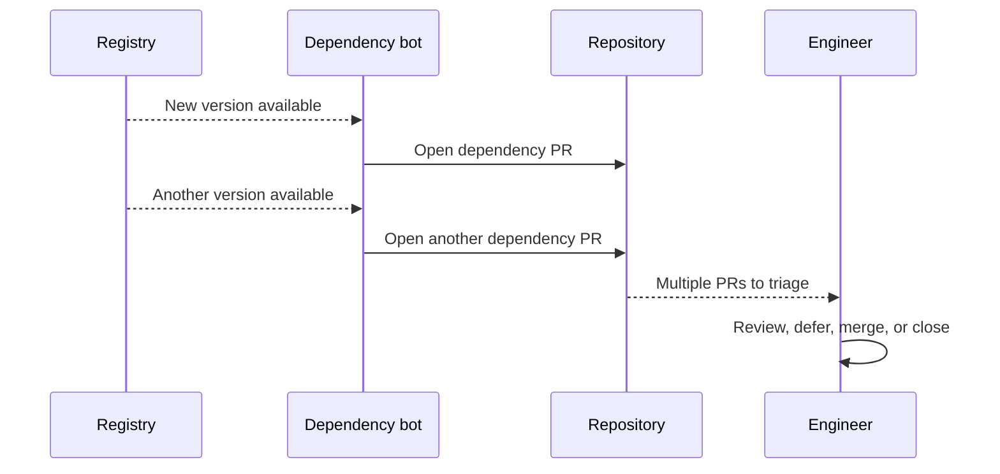
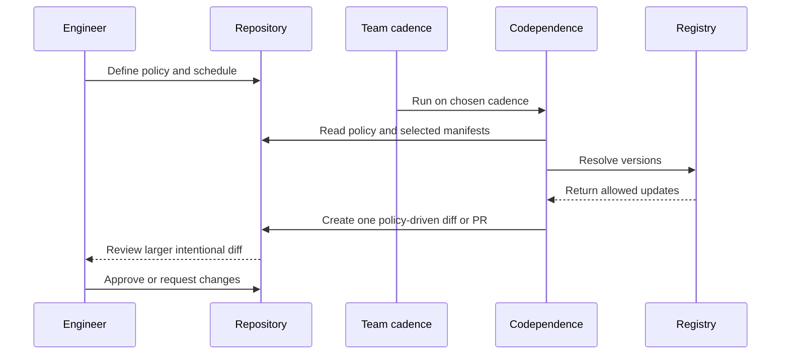

# [Codependence](https://jeffry.in/codependence/)

[](https://www.npmjs.com/package/codependence)
[](https://www.npmjs.com/package/codependence)
[](https://scorecard.dev/viewer/?uri=github.com/yowainwright/codependence)
[](https://codecov.io/gh/yowainwright/codependence)

#### One configuration for every dependency manager.

**Codependence** checks and updates dependency versions using one-to-many project policies with support for Node, Python, Go, Rust, Docker, and GitHub Actions. This means you control how you update and why you update. Versus other tools, Codependence caters to a project's context vs a dependency's context.

---

## Main use case

### Pin what matters and update the rest

Suppose a project must stay on React `^19.0.0`, but its other dependencies should keep moving. Add that policy to `.codependencerc`:

```json
{
  "config": {
    "app": {
      "path": "package.json",
      "manager": "pnpm",
      "mode": "precise",
      "codependencies": [{ "react": "^19.0.0" }]
    }
  }
}
```

Run the update:

```sh
codependence --update
```

React stays pinned while lodash updates:

```diff
 "dependencies": {
   "react": "^19.0.0",
-  "lodash": "^4.17.20"
+  "lodash": "^4.17.21"
 }
```

The policy runs the same thing everywhere!—Locally in scripts or in CI; it's the same and you own it. 
See more [recipes below](#recipes)!

---

## Install

<!-- installation commands matching package.json name and the Homebrew release workflow -->

```sh
npm install codependence
# or
brew install yowainwright/tap/codependence
```

You can also install Codependence globally with npm, Bun, pnpm, or Deno.

---

## Configuration

<!-- init command behavior from src/cli/index.ts -->

Initialize. That's it!

```sh
codependence init
```

### What it does

- Finds package manifests.
- Asks for the dependency policy and enforcement.
- Creates or updates the configuration.

> [!NOTE]
> Use `init config [directory]` for configuration only and `init actions` to generate GitHub Actions workflows.
>
> For a JavaScript project, you can use a `codependence` dependency policy object in `package.json`. 
> For larger or mixed-language projects, you can create Codependence config files for your project's dependency needs:

```json
{
  "codependence": "./.codependencerc"
}
```

The config path is relative to manifest files, e.g. `package.json`.
Each entry in `config` represents one manifest and requires `path` and `manager`; `name` is optional.

> Editors can use the published [configuration schema][configuration-schema] for validation and completion.
> - [configuration-schema]: https://unpkg.com/codependence/src/config/schema.json

```sh
codependence
codependence --update
```

---

## CLI

Codependence, although it can be used with Node.js, is a CLI-first policy tool.

> Run `codependence --help` for every option.

<!-- CLI command and options from src/cli/constants.ts -->

```sh
Usage: codependence [command] [options]

Commands:
  init [directory]                  Run guided project setup
  init config [directory]           Create or update configuration only
  init actions [managers...]        Generate GitHub Actions workflows
```

### Option Reference

Configuration can live in `package.json` or a referenced `.codependencerc`. 
Use CLI flags for execution choices such as checking, updating, and output formatting.

---

#### `config`: manifest dictionary

<!-- manifest config shape from src/types.ts and src/config/index.ts -->

Each key identifies one manifest. Every entry requires a direct `path` and a
`manager`; `name` is optional. Policy fields apply only to that manifest.

```json
{
  "config": {
    "web": {
      "name": "@project/web",
      "path": "packages/web/package.json",
      "manager": "pnpm",
      "codependencies": ["typescript"]
    },
    "actions": {
      "path": ".github/workflows/update.yml",
      "manager": "github-actions",
      "mode": "precise"
    }
  }
}
```

---

#### `codependencies`: `Array<string | Record<string, string>>`

`codependencies` is a manifest policy array. String entries track the latest version; object entries pin an exact version or range.

- The default value is `undefined`
- An array is required!

---

#### Version policy entries

The Codependence `codependencies` array supports `latest` out-of-the-box.

> So having this `["fs-extra", "lodash"]` will return the `latest` versions of the packages within the array. It will also match a specified version, like so `[{ "foo": "1.0.0" }]` and `[{ "foo": "^1.0.0" }]` or `[{ "foo": "~1.0.0" }]`. You can also include a `*` **at the end** of a name you would like to match. For example, `@foo/*` will match all packages with `@foo/` in the name and return their latest versions. This will also work with `foo-*`, etc.

**Codependence** is built in to give you more capability to control your dependencies!

---

#### Manifest fields

- `path`: required config-relative path to one manifest
- `manager`: required dependency manager
- `name`: optional package or project name, useful when one directory contains multiple manifests

---

#### `update`: `boolean`

An optional root boolean that applies approved dependency updates across every entry.

- The default value is `false`

---

#### `rootDir`: `string`

An **optional** string which can be used to specify the root directory to run checks from;

- The default value is `"./"`

---

#### `ignore`: `Array<string>`

An **optional** array of strings used to specify directories to ignore

- `.git`, `.next`, `.venv`, `node_modules`, and `*.dockerignore` files are ignored by default
- an explicit `ignore` array replaces these defaults for 0.x compatibility
- glob patterns are accepted

---

#### `debug`: `boolean`

An **optional** boolean value used to enable debugging output

- The default value is `false`

---

#### `silent`: `boolean`

An **optional** boolean value used to enable a more silent developer experience

- The default value is `false`

---

#### `--config`: `string`

An optional path to a configuration file. Without it, Codependence searches upward, preferring `package.json` and then `.codependencerc` variants in each directory.

- The default is `undefined`

---

#### `searchPath`: `string`

An **optional** string containing a search path for location config files.

- The default value is `undefined`

#### `yarnConfig`: `boolean`

An **optional** boolean value used to enable **yarn config** checking

- The default value is `false`

---

#### `permissive`: `boolean`

Controls whether all dependencies are updated to latest except those listed in `codependencies`.

- The default value is `false` when `codependencies` are provided, for compatibility with 0.x jobs
- When `true`, all dependencies NOT listed in `codependencies` are updated to latest — your `codependencies` list is what you want to **pin**
- Use `--mode precise` (CLI) or `mode: "precise"` (config) for the same pin-and-update-everything-else behavior

---

#### `level`: `"patch" | "minor" | "major"`

An **optional** string constraining how far updates are allowed to reach.

- `"patch"` — only update within the same minor version (e.g. `1.2.x`)
- `"minor"` — only update within the same major version (e.g. `1.x.x`)
- `"major"` — allow any update (default)

---

#### `mode`: `"verbose" | "precise"`

An **optional** string controlling which packages are checked.

- `"verbose"` — only check/update the packages listed in `codependencies` (0.x compatible behavior)
- `"precise"` — update all dependencies except those listed in `codependencies` (same as permissive behavior)

---

#### `dryRun`: `boolean`

An **optional** boolean that previews what would change without modifying any files.

- The default value is `false`

---

#### `interactive`: `boolean`

An **optional** boolean that prompts you to select which packages to update when combined with `--update`.

- The default value is `false`

---

#### `watch`: `boolean`

An **optional** boolean that enables continuous checking, re-running every 30 seconds.

- The default value is `false`

---

#### `noCache`: `boolean`

An **optional** boolean that bypasses the version cache for fresh registry results.

- The default value is `false`

---

#### `format`: `"json" | "markdown" | "table"`

An **optional** string specifying the output format. When set, disables the spinner and outputs structured data instead.

- `"json"` — machine-readable JSON
- `"markdown"` — Markdown table (useful for PR comments)
- `"table"` — formatted table (default when flag is used)

---

#### `outputFile`: `string`

An **optional** path to write formatted output to a file instead of stdout. Requires `format` to be set.

---

## Codependence GitHub Action

<!-- generated workflow behavior from src/cli/index.ts -->

Generate split workflows from the configured managers:

```sh
codependence init actions
```

This creates up to six stable workflow files for Node, Python, Go, Rust,
Docker, and GitHub Actions. Docker runs alone so its updates stay on the
`update-dependencies/docker` pull-request branch. Existing files are preserved
unless `--force` is provided.

<!-- partial update and pull request inputs from action.yml -->

Run one configured manager with an exact tool version:

```yaml
- uses: yowainwright/codependence@v1
  with:
    targets: bun
    version: 1.3.14
```

Rust accepts exact stable `x.y.z` toolchains and normalizes an optional leading
`v` before invoking rustup.

Public Docker Hub and GHCR images need no registry inputs. Private images use
repository secrets without placing credentials in `.codependencerc`:

```yaml
- uses: yowainwright/codependence@v1
  with:
    targets: docker
    dockerhub-username: ${{ vars.DOCKERHUB_USERNAME }}
    dockerhub-token: ${{ secrets.DOCKERHUB_TOKEN }}
    ghcr-username: ${{ github.actor }}
    ghcr-token: ${{ secrets.GITHUB_TOKEN }}
```

PR mode requires a fine-grained PAT and `post-update-command`. Each manager set
uses a stable branch, so scheduled Bun, Go, Rust, uv, Docker, and GitHub Actions
workflows maintain separate pull requests while repeated runs update the
existing PR. See the [GitHub Action guide](.github/ACTION.md) for lockfile
policy and PAT permissions.

---

## Codependence in Node

Although **Codependence** is built primarily as a CLI utility, it can be used as a Node utility.

```ts
import { checkFiles, codependence } from "codependence";

const checkForOutdated = async () => {
  try {
    await checkFiles({ codependencies: ["fs-extra", "lodash"] });
    console.log("All dependencies are up-to-date");
  } catch (err) {
    console.error("Dependencies are out of date:", (err as Error).message);
  }
};

const updateAllExceptSpecific = async () => {
  await codependence({
    codependencies: ["react", "lodash"],
    permissive: true,
    update: true,
  });
};

checkForOutdated();
```

---

## Recipes

Read below to see how codependence might help you!

### Check deps _without_ a config

Use CLI policy flags for a temporary check:

```sh
codependence --codependencies 'lodash' '{ "fs-extra": "10.0.1" }'
```

### Match packages by name

Use `*` at the end of a package name to match a group:

```sh
codependence --codependencies '@foo/*' --update
```

### Pin selected packages and update the rest

List the packages that should stay pinned

```sh
codependence --permissive --codependencies 'react' 'lodash' --update
```

### Configure multiple manifests

You can configure multiple project manifests via a single or multiple codependence policy files.

1. Use a skey for each manifest. 
2. `name` can distinguish manifests in the same directory.

```json
{
  "config": {
    "web": {
      "name": "@project/web",
      "path": "packages/web/package.json",
      "manager": "pnpm",
      "mode": "precise"
    },
    "api": {
      "path": "services/api/go.mod",
      "manager": "go",
      "mode": "precise"
    }
  }
}
```

---

## Multi-language, multi-package manager support (experimental)

Declare each ecosystem through a manifest entry in `.codependencerc`. The
`--language` flag remains available for one-off runs:

```sh
codependence --language {uv,go,rust,docker,github-actions}
```

### Supported managers

#### Languages

> ##### Language manifest updates
> 
> - Non-Node providers remain experimental, but all managers can share one `config` dictionary.
> - Python requirements updates preserve comments, markers, hashes, and include directives. 
> - Unversioned and URL-based requirements are left unchanged. After updating manifests, regenerate and commit ecosystem lockfiles with their native package managers.

##### JavaScript

- [bun](https://bun.sh/)
- [npm](https://www.npmjs.com/)
- [pnpm](https://pnpm.io/)
- [yarn](https://yarnpkg.com/)

##### Python

- [conda](https://conda.org/)
- [pip](https://pip.pypa.io/)
- [pipenv](https://pipenv.pypa.io/)
- [poetry](https://python-poetry.org/)
- [uv](https://docs.astral.sh/uv/)

##### Go

- [golang](https://go.dev/)

##### Rust

- [cargo](https://doc.rust-lang.org/cargo/)

#### Containers

- [docker](https://www.docker.com/)

> #### Docker Notes
> 
> - The Docker provider supports explicit pins, latest tag resolution, and `mode: "precise"` for Docker Hub and GHCR images.
> - It selects the highest stable numeric tag that is at least as specific as the current tag and has its exact prefix and suffix, so `20-slim` remains in the `-slim` family and `3.19` does not switch to a date tag. 
> - Repeated images with different tag families resolve independently. 
> - `FROM` tags assembled from one Docker `ARG` are resolved and updated without changing the composition. 
> - Digest-pinned images, scratch stages, unresolved variables, and unsupported registries remain unchanged.
> - Mutable tags such as `latest` fail rather than guessing a version.
> - The CLI reads Docker Hub credentials from `DOCKERHUB_USERNAME` and `DOCKERHUB_TOKEN`. 
> - GHCR uses `GHCR_USERNAME` and `GHCR_TOKEN`. Both values are required for authenticated registry access

#### CI

- [github-actions](https://github.com/features/actions)

> #### GitHub Action Notes
> 
> - The GitHub Action falls back to its workflow token for private GHCR packages and retries anonymously when GHCR rejects that token for a public package. Docker Hub PATs should be read-only; private GHCR packages require `read:packages` access.
> - The GitHub Actions provider supports explicit pins, latest release resolution, and `mode: "precise"`. 
> - Latest versions resolve to immutable commit SHAs, and existing version comments are refreshed with the release tag. 
> - Local and Docker actions remain unchanged. 
> - Authenticated lookups use `GITHUB_TOKEN` or `GH_TOKEN` when available.


> [!NOTE]
> Execution options such as `update`, `dryRun`, `format`, and `noCache` stay at the root. 
>
> Use `--target pnpm` or `--target go` to run only entries for those managers.

<!-- provider capabilities from src/providers/*/index.ts -->

--- 

## Policy Surface

Codependence currently focuses on package manifests and dependency sections. 
The same policy model can expand to other version surfaces over time.

| Surface                        | Status       | Purpose                                                                    |
| ------------------------------ | ------------ | -------------------------------------------------------------------------- |
| `package.json` dependencies    | Supported    | Enforce dependency policy in Node.js projects and monorepos                |
| Python, Go, and Rust manifests | Experimental | Apply the same check/update workflow outside Node.js                       |
| Dockerfiles                    | Experimental | Check base image versions                                                  |
| GitHub Actions workflows       | Experimental | Check action refs in workflow YAML                                         |
| Local repository scans         | Roadmap      | Report drift across a directory of projects, such as `~/code`              |
| Toolchain files                | Roadmap      | Keep `.nvmrc`, `.node-version`, `.tool-versions`, and `.mise.toml` aligned |
| Compose and other CI YAML      | Roadmap      | Check service images, actions, and runtime versions in pipeline files      |

---

> [!NOTE]
> ### Codependencies are project dependencies that must stay current or match a specified version.
> 
> When a manifest cannot use `latest` directly, Codependence writes the resolved version required by its policy. Exact versions and supported ranges remain explicit in `.codependencerc`.

---

## Tool comparison

### Why use Codependence?

**Codependence** is focused on one job: enforcing dependency version policy where your code actually runs.

#### Typical hosted dependency PR flow

When updates arrive independently, engineers can receive a stream of small PRs
to triage and review.



#### Codependence cadence-controlled flow

The team chooses the cadence and policy, then reviews a larger, intentional
diff when Codependence runs.



- It gives teams a small, explicit policy for versions that must stay current or pinned.
- It can fail CI when dependency versions drift.
- It can update only listed packages, or update everything except listed packages.
- It manages multiple dependency managers and monorepo scopes from one `.codependencerc`.
- It runs locally, from npm scripts, in GitHub Actions, or in other CI providers.
- It exposes a Node API for custom workflows and internal tooling.

---

### Why _not_ use Codependence?

**Codependence** isn't for everybody or every repository. Here are some reasons why it _might not_ be for you!

- You only need hosted dependency PRs and are happy with Dependabot or Renovate.
- You do not need local or CI enforcement for version drift.
- You prefer manually pinning versions without automated checks.
- You do not need package-specific or workspace-specific dependency policy.

---

## Demos

In Action!

- **[Codependence Cron](https://github.com/yowainwright/codependence-cron):** Codependence running off a GitHub Action cron job.
- **[Codependence Monorepo](https://github.com/yowainwright/codependence-monorepo):** Codependence monorepo example.

---

## Debugging

### `private packages`

If there is a `.npmrc` file, there is no issue with **Codependence** monitoring private packages. However, if a yarn config is used, Codependence must be instructed to run `version` checks differently.

### Fixes

- With the CLI, add the `--yarnConfig` option.
- With Node.js, add `yarnConfig: true` to your options or your config.
- For other private package issues, submit an [issue](https://github.com/yowainwright/codependence/issues) or [pull request](https://github.com/yowainwright/codependence/pulls).

---

## Development

The repository uses Node.js 26 and pnpm 11. [mise](https://mise.jdx.dev/) installs the pinned development tools.

```sh
mise install
pnpm install
pnpm test
```

### Release Strategy

Codependence publishes securely to npm with trusted publishing, provenance attestations, and immutable GitHub release assets.
Stable releases also publish an audited, SHA256-pinned Homebrew formula through a protected environment and reviewed tap pull request.

### 0.3.1 compatibility

The v1 CLI keeps the final pre-1.0 contract from `0.3.1`: the `codependence`
and `cdp` binaries, pre-1.0 CLI flags, flat and embedded `package.json` policy,
and listed-only `codependencies` behavior. The named `script` export retains
the pre-1.0 non-throwing API. Use `checkFiles` or `codependence` when callers
need v1 errors and version-diff results.

---

### Contributing

[Contributing](.github/CONTRIBUTING.md) is straightforward.

### Issues

- Include context and reproduction steps.
- Submit a pull request when appropriate.

### Pull Requests

- Add a test or explain why one is not needed.
- Update the README when behavior or documentation changes.
- Use the [pull request template](.github/PULL_REQUEST_TEMPLATE.md).

Thank you!

---

## Shoutouts

Thanks to [Dev Wells](https://github.com/devdumpling) and [Steve Cox](https://github.com/stevejcox) for the aligned code leading to this project. Thanks [Navid](https://github.com/NavidK0) for some great insights to improve the API!

---

Made by [@yowainwright](https://github.com/yowainwright), MIT 2022-present
